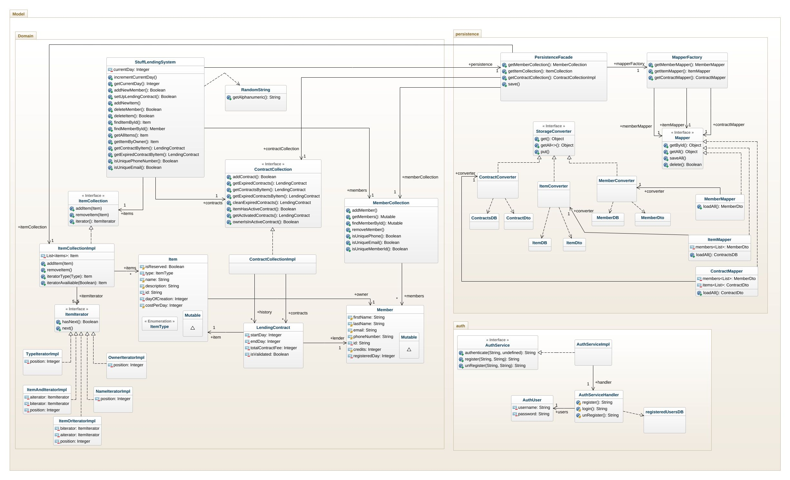

# Stuff Lending System OO-Design
This document describes the design according to the requirements presented in assignment 2.

## Design reflection

### Grade_3 requirement 1. (Authentication)
We have built an member-based authentication. That means that you are not authenticated as a "system admin", but as a member in the Stuff Lending System. 
Credentials are stored in a mocked database in `model`, with a basic auth service. When credentials is handled in `controller`, they are encapsulated in a temporary object to make password handling as safe as possible. 
Strategy-pattern is used for the user interface, so an unauthorized user can not access resources they do not have the rights for.

### Grade_3 requirement 2. (Searching)
Items are searchable in a flexible way (in model). ItemCollection have methods that return iterators, both for single search or nested search. The nested iterators are built in the way that you provide two other iterators as an argument. If you do not want to setup your own search, there are pre-defined search methods on ItemCollection to be used.

## Architectural Overview
The application uses the model-view-controller (MVC) architectural pattern. The view is passive and gets called from the controller. The view may only read information from the model, not directly change it.

## Detailed Design

We provides two different class diagrams. One diagram will show the dependencies between the packages in this MVC-architecture. In this diagram, all classes that the view- and controller package holds are visualized, but the model package is scaled down to get a better overview of the dependencies. 

Since we do not have any dependencies going <i>from</i> the model, the second diagram does only contain the model package, and will visualize both domain-, persistence- and auth-package in detail. 

### Class Diagram

### Sequence Diagram
The user has selected `Add member` from the `Member menu` in the system and the sequence that follows is illustrated below.  
_(Instead of illustrating the single scenarios if email or phone is not unique when adding member we merged them together in a single alternative scenario)_

### Object Diagram
The diagram corresponds to the scenario above just **after** the illustrated sequence.  
(The `red link-lines` indicates that the lifetime of the object is limited to the sequence.)

