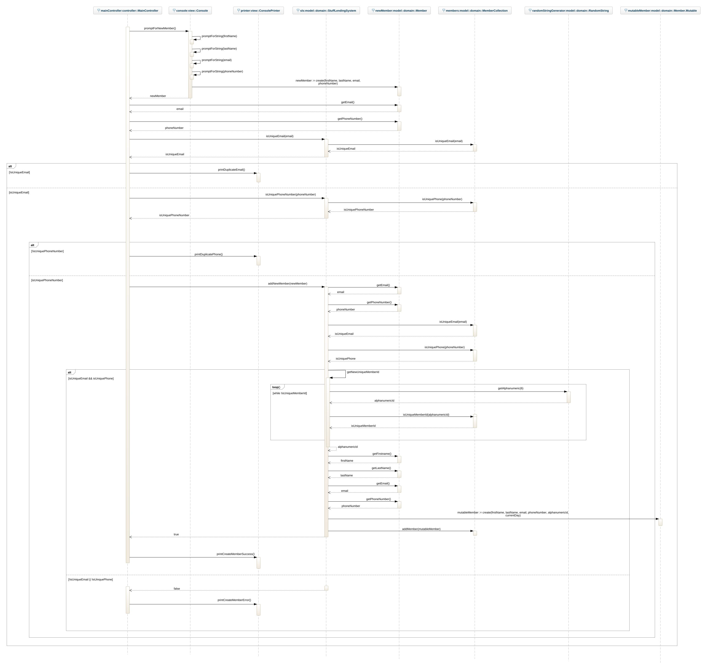

# Stuff Lending System OO-Design
This document describes the design according to the requirements presented in assignment 2.

## Architectural Overview
The application uses the model-view-controller (MVC) architectural pattern. The view is passive and gets called from the controller. The view may only read information from the model, not directly change it.

## Detailed Design

We provides two different class diagrams. One diagram will show the dependencies between the packages in this MVC-architecture. In this diagram, all classes that the view- and controller package holds are visualized, but the model package is scaled down to get a better overview of the dependencies. 

Since we do not have any dependencies going <i>from</i> the model, the second diagram does only contain the model package, and will visualize both domain- and repository package in detail. 

### Class Diagram
Please provide at least one class diagram according to the assignment requirments.

### Sequence Diagram
The user has selected `Add member` from the `Member menu` in the system and the sequence that follows is illustrated below.  
_(Instead of illustrating the single scenarios if email or phone is not unique when adding member we merged them together in a single alternative scenario)_

### Object Diagram
The diagram corresponds to the scenario above just **after** the illustrated sequence.  
(The `red link-lines` indicates that the lifetime of the object is limited to the sequence.)

